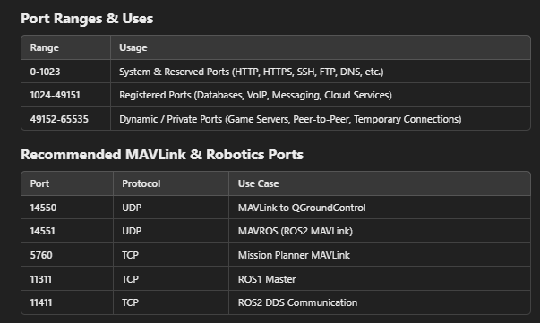

# CMD UTILES POUR ARDUPILOT

## INSTAL SUR LINUX
Pour installer ArduPilot sur Linux en "home" (https://ardupilot.org/dev/docs/building-setup-linux.html#building-setup-linux):
 - git clone  --recurse-submodules https://github.com/ArduPilot/ardupilot.git
Puis exctuez dans le fichier ardupilot qui vient d'appraitre :
 - Tools/environment_install/install-prereqs-ubuntu.sh -y
 - . ~/.profile (puis lot out pour appliquer les chgmts)

## INSTAL SUR WINDOWS de mavproxy
 - pip install wxPython
 - pip install mavproxy
Les commandes sont les même autrement normalement

## MAVProxy
Ressources : https://ardupilot.org/mavproxy/index.html
All cmd to control : https://ardupilot.org/mavproxy/docs/uav_configuration/index.html#

CONVENTION : 57=Debug 58=Popeye 59=Olive +++ 60=mavproxy 61=debugEnToutGenre 62=MissionPlanner 63=QGroundStation 64=ROS2

CMD DE LANCEMENT POPEYE (attention usb peut changer) :
 - SITL : 
 - REAL : mavproxy.py --master=/dev/ttyUSB0 --out=tcpin:127.0.0.1:5860 --out=tcpin:127.0.0.1:5861 --out=tcpin:127.0.0.1:5862 --out=tcpin:127.0.0.1:5863 --out=tcpin:127.0.0.1:5864
CMD DE LANCEMENT OLIVE (attention usb peut changer) :
 - SITL : 
 - REAL : mavproxy.py --master=/dev/ttyUSB1 --out=tcpin:127.0.0.1:5960 --out=tcpin:127.0.0.1:5961 --out=tcpin:127.0.0.1:5962 --out=tcpin:127.0.0.1:5963 --out=tcpin:127.0.0.1:5964

Port usage (verify witch are use with : sudo netstat -tulnp
) : 

Commande de lancement :
 - mavproxy.py --master=tcp:127.0.0.1:5760 --out=tcpin:127.0.0.1:5765
(127.0.0.1 est l’adresse de boucle locale (localhost) : Si tu utilises 127.0.0.1, seules les applications locales (sur la même machine) peuvent se connecter)
(0.0.0.0 signifie « toutes les interfaces réseau » : Si tu configures un programme pour écouter ou émettre sur 0.0.0.0, il sera accessible depuis n’importe quelle machine qui peut atteindre ton ordinateur via le réseau.)
Pour rediriger vers l'hote windows :
 - mavproxy.py --master=tcp:127.0.0.1:5763 --out=udp:127.0.0.1:14550

Sur la radio dans un COM windows :
 - mavproxy.py --master=COM3 --baudrate 57600

Pour ne pas avoir l'affichage du bruit :
 - set shownoise false

Usefull info : https://ardupilot.org/mavproxy/docs/getting_started/faq.html
For multiple vehicle : https://ardupilot.org/mavproxy/docs/getting_started/multi.html

## LANCER UNE SIMU
Lancer un SITL
 - sim_vehicle.py -v ArduCopter --map --console
Ou pour pas etre encombré :
 - sim_vehicle.py -v ArduCopter
Sans Mavproxy
 - sim_vehicle.py -v ArduCopter --no-mavproxy
Pour en lancer 2 :
 - sim_vehicle.py -v ArduCopter --no-mavproxy --instance=0 (5760 5762 5763)
 - sim_vehicle.py -v ArduCopter --no-mavproxy --instance=1 (5770 5772 5773)

=> Si vous lancer le sitl dans linux et que vous ouvrez QGS sur windows, la connexion est automatique (a condition d'avoir setup la connectionTCP sur un des pourt Mavlink du STIl en automatique dans les paramètre QGS)

