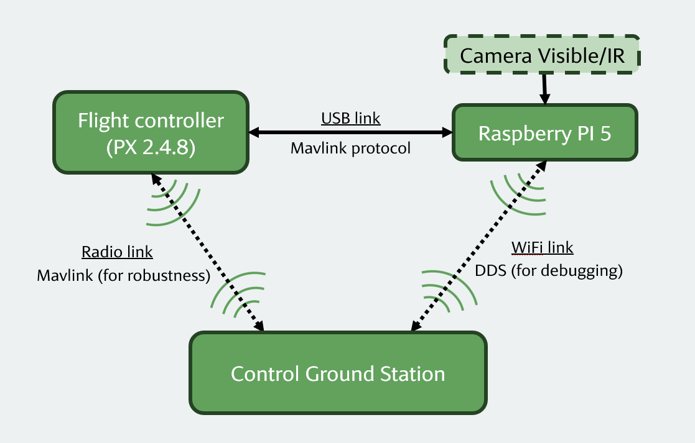

# DUAV ROS2 Controller
This repository provides a ROS 2 middleware interface for controlling two UAVs simultaneously via ArduPilot. It was developed by our team, Gadz'Aero, for the Dassault UAV Challenge 2025.

Summary :
 - [Installation process](./docs/install.md)
 - [ROS2 ressources](./docs/ros2_ressources.md)
 - [Useful commands for launch and testing](./docs/commands.md)

## Hardware Architecture
Each UAV is connected to a Pixhawk 2.4.8 (PX) flight controller, which communicates via MAVLink over USB with a Raspberry Pi 5 (RP5). The RP5s act as onboard computers, enabling each UAV to connect to the Control Ground Station (CGS) through a 2.4 GHz antenna.

The RP5s use the pymavlink library to intercept and filter MAVLink data streams, extracting only the information required for high-level control and fire position detection.

We chose the RP5 for onboard control due to its robustness; relying solely on the CGS proved unreliable in early tests due to frequent disconnections. Initially, we used MAVLink for command and Wi-Fi for debugging (via ROS 2). However, Wi-Fi — even with a powerful antenna — proved unstable for UAV communication, so it's not recommended.

Below is a schematic summarizing our hardware control architecture:

  

## Software Architecture
To control both UAVs and enable reliable communication between them, we opted not to use MAVROS. At the time, its ROS 2 support was still under development, poorly documented, and difficult to compile on the RP5. Instead, we efficiently used minimal pymavlink scripts for commanding our UAVs.

The software stack is organized into three main ROS 2 packages:
 - `olive` (the plane): Performs fire detection and reports position while flying along a predefined Mission Planner route. Minimal ROS 2 logic is used.
 - `control_ground_station`: Acts as a relay to transfer detected fire locations from Olive to Popeye.
 - `popeye` (the hexacoter): Contains most of the system's intelligence, including:
    - A Finite State Machine (FSM) for high-level decision making
    - A camera analysis node using OpenCV
 - `interfaces`: to store custom .msg, .srv and, .action files
 
While this per-agent package design can lead to large packages as features scale, it offered simplicity and speed during development and testing.

## Launch the application

We did not take the time to make a proper .launch.py. Thus, nodes have to be launch one after the other

